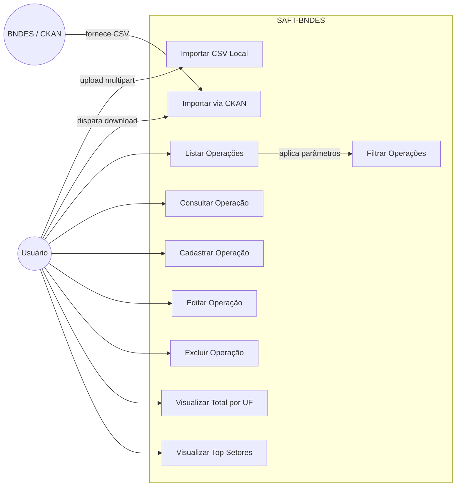
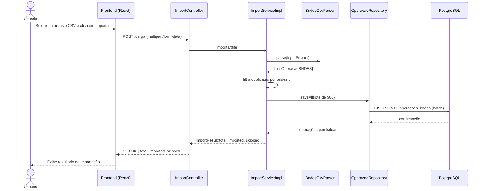

# SAFT-BNDES — Sistema de Apoio ao Financiamento Tecnológico

> **Disciplina:** Técnicas de Programação — Profa. Mestre Sirley Ambrosia Vitorio Addão  
> **Integrantes:** João Portela · Matheus Rosa  
> **Data de entrega:** 15/05/2026

---

## Objetivo do Projeto

O SAFT-BNDES é uma aplicação Full Stack (Java + React) que transforma dados brutos de financiamentos do BNDES em informações estratégicas para apoiar pequenas empresas de tecnologia na tomada de decisão.

O sistema consome dados reais do [Portal de Dados Abertos do BNDES](https://dadosabertos.bndes.gov.br), permitindo:
- Importar operações de financiamento via CSV (upload local ou download automático)
- Consultar, filtrar, cadastrar, editar e excluir operações
- Visualizar insights como total financiado por estado e os setores mais financiados

---

## Diagrama de Arquitetura

```
Browser (React)
      ↕  HTTP / JSON
  Controller  (OperacaoController · InsightController · ImportController)
      ↕
   Service    (OperacaoService · InsightService · ImportServiceImpl)
      ↕
  Repository  (OperacaoRepository — JpaRepository + JpaSpecificationExecutor)
      ↕
   Banco de Dados (PostgreSQL via Docker)
```

Fluxo de importação de dados:

```
Arquivo CSV (local ou BNDES/CKAN)
      ↓
  ImportController  POST /carga
      ↓
  ImportServiceImpl → BndesCsvParser (Apache Commons CSV)
      ↓
  OperacaoRepository.saveAll()
      ↓
  Tabela operacoes_bndes
```

---

## Diagrama de Caso de Uso



---

## Diagrama de Sequência — Importação de CSV



---

## Tecnologias Utilizadas

| Camada | Tecnologia | Justificativa |
|---|---|---|
| Coleta/Ingestão | Java (File I/O) + Apache Commons CSV | Leitura e parsing do CSV do BNDES |
| ETL / Lógica | `ImportServiceImpl` (Java) | Converte Strings do CSV para `BigDecimal`, `LocalDate`, etc. |
| Banco de Dados | PostgreSQL (Docker) | Banco robusto autorizado pela professora; alternativa ao H2 |
| Backend | Spring Boot 3 + JPA/Hibernate | Endpoints REST, camadas bem definidas, injeção de dependência |
| Frontend | React | Dashboard, filtros em tempo real e formulário de cadastro |

---

## Estrutura de Camadas (Spring Boot)

```
src/main/java/com/saftbndes/api/
├── domain/          # @Entity — OperacaoBNDES
├── repository/      # @Repository — OperacaoRepository (JpaRepository)
├── service/         # @Service — OperacaoService, InsightService
├── controller/      # @RestController — OperacaoController, InsightController, ImportController
├── dto/             # DTOs de entrada e saída (OperacaoCreateRequest, OperacaoResponse, etc.)
├── mapper/          # OperacaoMapper (Entity ↔ DTO)
├── importer/        # Lógica de importação CSV (ImportServiceImpl, BndesCsvParser)
├── specification/   # Filtros dinâmicos (OperacaoSpecifications)
├── exception/       # ResourceNotFoundException (→ 404)
└── config/          # CORS, Swagger, propriedades CKAN/CSV
```

---

## Mapeamento da Entidade `OperacaoBNDES` (`@Entity`)

Classe anotada com `@Entity`, `@Table`, `@Id` e `@GeneratedValue`. Representa uma linha de financiamento do BNDES.

| Atributo Java | Coluna no Banco | Tipo | Descrição |
|---|---|---|---|
| `id` | `id` | `Long` | Chave primária gerada automaticamente (`@Id @GeneratedValue`) |
| `bndesId` | `bndes_id` | `Long` | ID original do registro no BNDES (único) |
| `cliente` | `cliente` | `String` | Nome da empresa financiada |
| `cnpj` | `cnpj` | `String` | CNPJ da empresa |
| `descricaoDoProjeto` | `descricao_do_projeto` | `String` | Descrição do projeto financiado |
| `uf` | `uf` | `String` | Estado (UF) da empresa |
| `municipio` | `municipio` | `String` | Município da empresa |
| `dataDaContratacao` | `data_da_contratacao` | `LocalDate` | Data de assinatura do contrato |
| `valorContratadoReais` | `valor_contratado_reais` | `BigDecimal` | Valor total contratado em R$ |
| `valorDesembolsadoReais` | `valor_desembolsado_reais` | `BigDecimal` | Valor efetivamente liberado em R$ |
| `setorBndes` | `setor_bndes` | `String` | Setor econômico classificado pelo BNDES |
| `subsetorBndes` | `subsetor_bndes` | `String` | Subsetor do BNDES |
| `porteDoCliente` | `porte_do_cliente` | `String` | Porte da empresa (ex: Pequena, Média) |
| `naturezaDoCliente` | `natureza_do_cliente` | `String` | Natureza jurídica da empresa |
| `situacaoDoContrato` | `situacao_do_contrato` | `String` | Status do contrato (ex: Contratado, Liquidado) |
| `inovacao` | `inovacao` | `String` | Indica se o projeto é classificado como inovação |
| `juros` | `juros` | `BigDecimal` | Taxa de juros aplicada |
| `prazoCarenciaMeses` | `prazo_carencia_meses` | `Integer` | Prazo de carência em meses |
| `prazoAmortizacaoMeses` | `prazo_amortizacao_meses` | `Integer` | Prazo de amortização em meses |
| `produto` | `produto` | `String` | Produto BNDES utilizado |
| `formaDeApoio` | `forma_de_apoio` | `String` | Forma de apoio (ex: Financiamento) |
| `instrumentoFinanceiro` | `instrumento_financeiro` | `String` | Instrumento financeiro utilizado |
| `instituicaoFinanceiraCredenciada` | `instituicao_financeira_credenciada` | `String` | Banco intermediário |

---

## Endpoints da API

### Operações (`/operacoes`)

| Método | Rota | Descrição | Status |
|---|---|---|---|
| `GET` | `/operacoes` | Lista operações com filtros e paginação | 200 OK |
| `GET` | `/operacoes/{id}` | Busca operação por ID | 200 OK / 404 Not Found |
| `POST` | `/operacoes` | Cadastra nova operação | 201 Created |
| `PUT` | `/operacoes/{id}` | Atualiza operação existente | 200 OK / 404 Not Found |
| `DELETE` | `/operacoes/{id}` | Remove operação | 204 No Content / 404 Not Found |

### Filtros disponíveis em `GET /operacoes`

| Parâmetro | Tipo | Descrição |
|---|---|---|
| `uf` | String | Filtra por estado (ex: `SP`, `RJ`) — usa `findByUfIgnoreCase` |
| `setor` | String | Filtra por setor BNDES — usa `findBySetorBndesIgnoreCase` |
| `valorMin` | BigDecimal | Filtra valor contratado maior que — usa `findByValorContratadoReaisGreaterThan` |
| `page` | int | Página (default 0) |
| `size` | int | Itens por página (default 20) |

### Carga de Dados (`/carga`)

| Método | Rota | Descrição | Status |
|---|---|---|---|
| `POST` | `/carga` | Importa CSV via upload ou download CKAN | 200 OK |

### Insights (`/insights`)

| Método | Rota | Descrição | Status |
|---|---|---|---|
| `GET` | `/insights/total-por-uf` | Total de financiamentos por estado (DTO) | 200 OK |
| `GET` | `/insights/top-setores?limit=5` | Top N setores mais financiados (DTO) | 200 OK |

---

## Exemplos de JSON

### `POST /operacoes` — RequestBody
```json
{
  "cliente": "Empresa Exemplo Ltda",
  "cnpj": "12.345.678/0001-99",
  "uf": "SP",
  "dataDaContratacao": "2023-06-15",
  "valorContratadoReais": 500000.00,
  "valorDesembolsadoReais": 450000.00,
  "setorBndes": "Industria de Transformacao",
  "porteDoCliente": "Pequena Empresa",
  "situacaoDoContrato": "Contratado"
}
```

### `GET /operacoes/{id}` — Response 200 OK
```json
{
  "id": 1,
  "bndesId": 123456,
  "cliente": "Empresa Exemplo Ltda",
  "cnpj": "12.345.678/0001-99",
  "uf": "SP",
  "dataDaContratacao": "2023-06-15",
  "valorContratadoReais": 500000.00,
  "valorDesembolsadoReais": 450000.00,
  "setorBndes": "Industria de Transformacao",
  "porteDoCliente": "Pequena Empresa",
  "situacaoDoContrato": "Contratado"
}
```

### `GET /operacoes/{id}` — Response 404 Not Found
```json
{
  "status": 404,
  "error": "Not Found",
  "message": "Operacao not found: 999"
}
```

### `POST /carga` — Response 200 OK
```json
{
  "total": 1000,
  "imported": 950,
  "skipped": 50
}
```

### `GET /insights/total-por-uf` — Response 200 OK
```json
[
  { "uf": "SP", "total": 1234567890.00 },
  { "uf": "RJ", "total": 987654321.00 }
]
```

### `GET /insights/top-setores?limit=5` — Response 200 OK
```json
[
  { "setor": "Industria de Transformacao", "total": 5000000000.00 },
  { "setor": "Tecnologia da Informacao", "total": 3000000000.00 }
]
```

---

## Justificativas Técnicas

### Por que `Optional` na busca por ID?
O método `findById()` do `JpaRepository` retorna `Optional<OperacaoBNDES>`. Usamos `.orElseThrow(() -> new ResourceNotFoundException(...))` para garantir que, caso o ID não exista, a API retorne automaticamente **HTTP 404** com mensagem clara — evitando `NullPointerException` em tempo de execução.

```java
// OperacaoService.java
OperacaoBNDES operacao = operacaoRepository.findById(id)
    .orElseThrow(() -> new ResourceNotFoundException("Operacao not found: " + id));
```

### Por que `ResponseEntity`?
Todos os endpoints retornam `ResponseEntity<DTO>`, permitindo controle explícito do status HTTP:
- `GET` → `ResponseEntity.ok(...)` → 200 OK
- `POST` → `ResponseEntity.status(HttpStatus.CREATED).body(...)` → 201 Created
- `DELETE` → `ResponseEntity.noContent().build()` → 204 No Content
- Erro → `@ResponseStatus(HttpStatus.NOT_FOUND)` → 404 Not Found

### Por que PostgreSQL em vez de H2?
A professora autorizou o uso de outros bancos. O PostgreSQL foi escolhido por ser um banco de produção real, permitindo validar o comportamento com grandes volumes de dados do BNDES e facilitar a visualização via pgAdmin ou DBeaver. O Docker garante que qualquer membro do grupo execute exatamente o mesmo ambiente.

### Por que Apache Commons CSV em vez de OpenCSV?
Apache Commons CSV tem suporte nativo a delimitadores configuráveis (`;`), encoding (`windows-1252`) e lida melhor com os formatos irregulares dos arquivos do BNDES Transparente.

---

## Manual de Importação do CSV

### Como obter o arquivo CSV do BNDES
1. Acesse [https://dadosabertos.bndes.gov.br](https://dadosabertos.bndes.gov.br)
2. Pesquise por **"Operações Indiretas Automáticas"** ou **"BNDES Transparente"**
3. Baixe o arquivo `.csv`

### Formato esperado do CSV
- **Encoding:** `windows-1252`
- **Delimitador:** `;` (ponto e vírgula)
- **Separador decimal:** `,` (vírgula)
- **Formato de data:** `yyyy-MM-dd'T'HH:mm:ss`
- **Cabeçalho obrigatório na primeira linha**

Colunas mapeadas automaticamente pelo sistema:

| Coluna no CSV | Campo na Entidade |
|---|---|
| `_id` | `bndesId` |
| `cliente` | `cliente` |
| `cnpj` | `cnpj` |
| `uf` | `uf` |
| `municipio` | `municipio` |
| `data_da_contratacao` | `dataDaContratacao` |
| `valor_contratado_reais` | `valorContratadoReais` |
| `valor_desembolsado_reais` | `valorDesembolsadoReais` |
| `setor_bndes` | `setorBndes` |
| `porte_do_cliente` | `porteDoCliente` |
| `inovacao` | `inovacao` |
| `situacao_do_contrato` | `situacaoDoContrato` |

### Como importar

**Opção 1 — Upload do arquivo local (Postman):**
1. Abra o Postman → `POST http://localhost:8080/carga`
2. Aba **Body** → selecione **form-data**
3. Adicione chave `file` (tipo File) → selecione o `.csv`
4. Clique em **Send**

**Opção 2 — Download automático do BNDES:**
```powershell
curl -X POST http://localhost:8080/carga
```
O sistema baixa o arquivo direto do portal BNDES via API CKAN.

---

## URLs de Produção

| Ambiente | URL |
|---|---|
| **Frontend (Vercel)** | [https://saft-bndes.vercel.app](https://saft-bndes.vercel.app/) |
| **Backend (Render)** | [https://saft-bndes-api.onrender.com](https://saft-bndes-api.onrender.com) |
| **Swagger (produção)** | [https://saft-bndes-api.onrender.com/swagger-ui.html](https://saft-bndes-api.onrender.com/swagger-ui.html) |

> **Atenção:** A URL do backend pode mudar caso o plano gratuito do Render expire.

---

## Guia de Execução

### Pré-requisitos
- Java 17+
- Docker Desktop
- Maven (ou usar o `mvnw.cmd` incluído no projeto)

### Passo a passo

**1. Clone o repositório**
```powershell
git clone https://github.com/Portela03/SAFT-BNDES.git
cd SAFT-BNDES/SAFT-BNDES-API
```

**2. Suba o banco de dados PostgreSQL**
```powershell
docker compose up -d
```

**3. Rode a aplicação**
```powershell
./mvnw.cmd spring-boot:run
```

A API estará disponível em `http://localhost:8080`.

**4. Acesse o Swagger UI**
```
http://localhost:8080/swagger-ui.html
```

**5. Confirme os dados no banco**
```powershell
docker exec -it saft-bndes-postgres psql -U saft -d saftbndes
```
```sql
SELECT id, cliente, uf, setor_bndes, valor_contratado_reais FROM operacoes_bndes LIMIT 10;
```

---

## Testando com o Postman

O arquivo `saft-bndes.postman_collection.json` na raiz do projeto contém uma coleção pronta com todos os endpoints.

### Como importar

1. Abra o **Postman**
2. Clique em **Import** (botão no canto superior esquerdo)
3. Selecione o arquivo `saft-bndes.postman_collection.json`
4. Clique em **Import**

### Variáveis da coleção

| Variável | Valor padrão | Descrição |
|---|---|---|
| `baseUrl` | `http://localhost:8080` | URL base da API. Altere para `https://saft-bndes-api.onrender.com` para testar em produção |
| `operacaoId` | *(preenchido automaticamente)* | ID da operação criada no passo 02; usado nos passos 03, 04, 08 e 09 |

> Para usar contra o ambiente de produção, edite a variável `baseUrl` na coleção: clique no nome da coleção → **Variables** → altere o valor de `baseUrl`.

### Fluxo de testes incluído

| # | Nome | Método | Rota | O que valida |
|---|---|---|---|---|
| 01 | List operacoes | GET | `/operacoes?size=5` | Status 200 |
| 02 | Create operacao | POST | `/operacoes` | Status 201 · salva `operacaoId` automaticamente |
| 03 | Get operacao by id | GET | `/operacoes/{{operacaoId}}` | Status 200 |
| 04 | Update operacao | PUT | `/operacoes/{{operacaoId}}` | Status 200 |
| 05 | List operacoes (filters) | GET | `/operacoes?uf=SP&setor=INDUSTRIA&valorMin=1000` | Status 200 |
| 06 | Insights total por uf | GET | `/insights/total-por-uf` | Status 200 |
| 07 | Insights top setores | GET | `/insights/top-setores?limit=3` | Status 200 |
| 08 | Delete operacao | DELETE | `/operacoes/{{operacaoId}}` | Status 204 |
| 09 | Get operacao after delete | GET | `/operacoes/{{operacaoId}}` | Status 404 |
| 10 | Import CKAN *(desativado)* | POST | `/carga` | Status 200 · habilitar só se necessário |

Execute os requests **na ordem** (01 → 09) para que `operacaoId` seja propagado corretamente entre os passos.

---

## Dicionário de Dados

| Campo | Descrição | Exemplo |
|---|---|---|
| **ID** | Chave primária interna gerada pelo sistema | `1` |
| **BNDES ID** | Identificador original do registro no BNDES | `987654` |
| **Cliente** | Nome da empresa que recebeu o financiamento | `Tech Startup LTDA` |
| **CNPJ** | Cadastro Nacional de Pessoa Jurídica da empresa | `12.345.678/0001-99` |
| **UF** | Unidade Federativa (estado) onde a empresa está localizada | `SP` |
| **Valor Contratado** | Valor total aprovado e contratado em reais | `R$ 500.000,00` |
| **Valor Desembolsado** | Valor efetivamente liberado pelo BNDES até o momento | `R$ 450.000,00` |
| **Setor BNDES** | Classificação setorial usada pelo BNDES | `Tecnologia da Informação` |
| **Porte do Cliente** | Tamanho da empresa conforme critérios do BNDES | `Pequena Empresa` |
| **Data da Contratação** | Data de assinatura do contrato de financiamento | `2023-06-15` |
| **Inovação** | Indica se o projeto é classificado como inovador | `Sim` / `Não` |
| **Situação do Contrato** | Estado atual do contrato | `Contratado`, `Liquidado` |
| **Juros** | Taxa de juros anual aplicada ao financiamento | `5,5%` |
| **Prazo de Carência** | Período em meses sem pagamento de amortização | `12` |
| **Prazo de Amortização** | Período em meses para quitação do contrato | `60` |

---

## Desafios Encontrados

- **Encoding do CSV:** O arquivo do BNDES usa `windows-1252`, não UTF-8. Foi necessário configurar o `BndesCsvParser` com o charset correto para evitar caracteres corrompidos em nomes de cidades e setores.
- **Separador decimal:** O CSV usa vírgula como separador decimal e ponto como separador de milhar (padrão BR). O parser precisou normalizar os valores antes de converter para `BigDecimal`.
- **Volume de dados:** O arquivo completo do BNDES tem centenas de milhares de linhas. Implementamos importação em lotes (`BATCH_SIZE = 500`) com controle de duplicatas via `bndesId` para evitar registros repetidos a cada importação.
- **CORS:** Foi necessário configurar o CORS no Spring Boot para permitir que o frontend React em `localhost:3000` consuma a API em `localhost:8080`.

---

## Diferenciais Técnicos

- Importação via **upload de CSV** (multipart) **ou** download automático da API CKAN do BNDES
- Filtros combinados e paginação via `JpaSpecification` (UF + Setor + Valor mínimo simultaneamente)
- Endpoint de insights com **total financiado por estado** e **top N setores**
- Documentação interativa via **Swagger UI** (`/swagger-ui.html`)
- Validação de entrada com `@NotBlank`, `@NotNull`, `@PositiveOrZero` nos DTOs

---

## Fontes de Dados

- [Portal de Dados Abertos do BNDES](https://dadosabertos.bndes.gov.br)
- [BNDES Hub de Projetos](https://hubdeprojetos.bndes.gov.br)
- [Portal de Transparência BNDES](https://www.bndes.gov.br/wps/portal/site/home/transparencia/consultaoperacoes)
- [BNDES Data](https://www.bndes.gov.br/wps/portal/site/home/transparencia/bndes-data)

## Requisitos
- Java 17
- Docker (para Postgres)

## Executar
1. Suba o Postgres com Docker:

```powershell
docker compose up -d
```

2. Rode a aplicacao Spring Boot com o Maven Wrapper:

```powershell
./mvnw.cmd spring-boot:run
```

## Banco de Dados
O projeto utiliza **PostgreSQL** como banco de dados. A escolha foi justificada pela autorizacao da professora para uso de bancos alternativos ao H2, e o Postgres oferece maior robustez para validacao dos dados importados.

- Conexao: `jdbc:postgresql://localhost:55432/saftbndes`
- Usuario: `saft` / Senha: `saft`
- Para visualizar os dados, acesse o banco via **pgAdmin**, **DBeaver** ou via terminal:

```powershell
docker exec -it saft-bndes-postgres psql -U saft -d saftbndes
```

Exemplo de consulta para conferir os dados importados:
```sql
SELECT id, cliente, uf, setor_bndes, valor_contratado_reais FROM operacoes_bndes LIMIT 10;
```

## Swagger
Swagger UI disponivel em `/swagger-ui.html`.

## Endpoints

| Metodo | Rota                     | Descricao                                      | Status |
|--------|--------------------------|------------------------------------------------|--------|
| POST   | /carga                   | Importa CSV (upload ou CKAN)                   | 200    |
| GET    | /operacoes               | Lista operacoes com filtros e paginacao        | 200    |
| GET    | /operacoes/{id}          | Busca operacao por ID                          | 200/404|
| POST   | /operacoes               | Cadastra nova operacao                         | 201    |
| PUT    | /operacoes/{id}          | Atualiza operacao existente                    | 200/404|
| DELETE | /operacoes/{id}          | Remove operacao                                | 204/404|
| GET    | /insights/total-por-uf   | Total de financiamentos por estado             | 200    |
| GET    | /insights/top-setores    | Top N setores mais financiados                 | 200    |

### Filtros disponiveis em GET /operacoes

| Parametro | Tipo      | Descricao                                |
|-----------|-----------|------------------------------------------|
| uf        | String    | Filtra por estado (ex: SP, RJ)           |
| setor     | String    | Filtra por setor BNDES                   |
| valorMin  | BigDecimal| Filtra valor contratado maior que        |
| page      | int       | Pagina (default 0)                       |
| size      | int       | Itens por pagina (default 20)            |

## Carga de Dados (POST /carga)

### Opcao 1 — Upload de CSV local
Envie o arquivo CSV do BNDES como `multipart/form-data`:

```powershell
curl -X POST http://localhost:8080/carga -F "file=@caminho/para/operacoes.csv"
```

### Opcao 2 — Download automatico via CKAN (Portal BNDES)
Chame sem arquivo para baixar direto do portal de dados abertos do BNDES:

```powershell
curl -X POST http://localhost:8080/carga
```

O sistema usa o CKAN (plataforma do portal de dados abertos do BNDES em https://dadosabertos.bndes.gov.br) para baixar o CSV automaticamente quando nenhum arquivo e enviado.

### Resposta da carga
```json
{
  "total": 1000,
  "imported": 950,
  "skipped": 50
}
```

## Exemplos de JSON

### POST /operacoes (RequestBody)
```json
{
  "cliente": "Empresa Exemplo Ltda",
  "cnpj": "12.345.678/0001-99",
  "uf": "SP",
  "dataDaContratacao": "2023-06-15",
  "valorContratadoReais": 500000.00,
  "valorDesembolsadoReais": 450000.00,
  "setorBndes": "Industria de Transformacao",
  "porteDoCliente": "Pequena Empresa",
  "situacaoDoContrato": "Contratado"
}
```

### GET /operacoes/{id} (Response 200)
```json
{
  "id": 1,
  "bndesId": 123456,
  "cliente": "Empresa Exemplo Ltda",
  "cnpj": "12.345.678/0001-99",
  "uf": "SP",
  "dataDaContratacao": "2023-06-15",
  "valorContratadoReais": 500000.00,
  "valorDesembolsadoReais": 450000.00,
  "setorBndes": "Industria de Transformacao",
  "porteDoCliente": "Pequena Empresa",
  "situacaoDoContrato": "Contratado"
}
```

### GET /operacoes/{id} (Response 404)
```json
{
  "status": 404,
  "error": "Not Found",
  "message": "Operacao not found: 999"
}
```

### GET /insights/total-por-uf
```json
[
  { "uf": "SP", "total": 1234567890.00 },
  { "uf": "RJ", "total": 987654321.00 }
]
```

### GET /insights/top-setores?limit=5
```json
[
  { "setor": "Industria de Transformacao", "total": 5000000000.00 },
  { "setor": "Tecnologia da Informacao", "total": 3000000000.00 }
]
```

